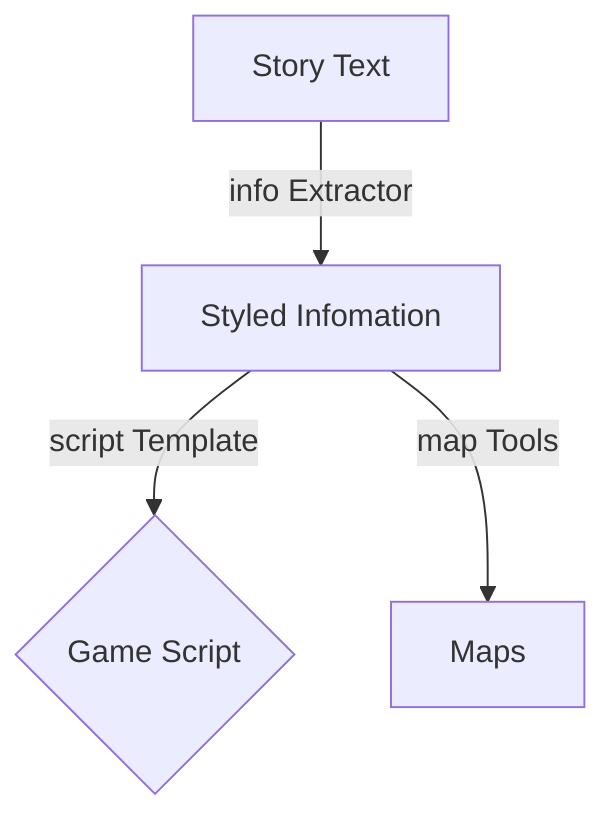
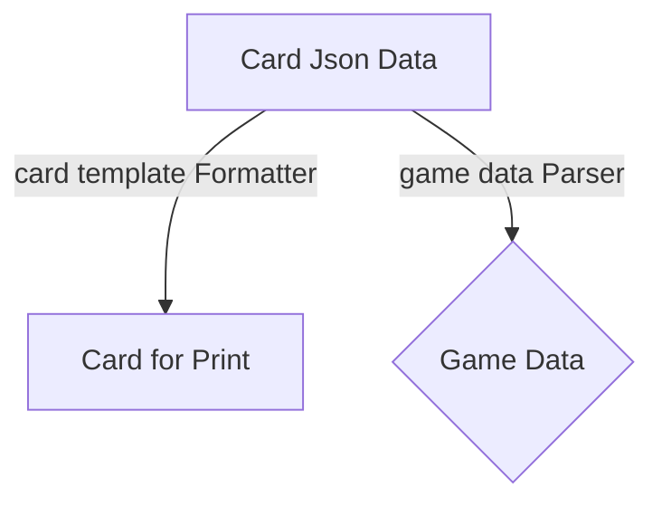

# Endymion

>   Draft of Hyperion

## 💡Inspiration and core principle

1.  项目的核心是一个命名为Card()的Object
    -   Card的数据暂时以json形式储存
    -   Card的数据用于如下部分：
        *   card for print自动排版生成可打印文件
        *   已拥有实体版Card Game的电子化
        *   其他用Hyperion Engine生成的电子游戏（例如江湖系列）

## Structure

