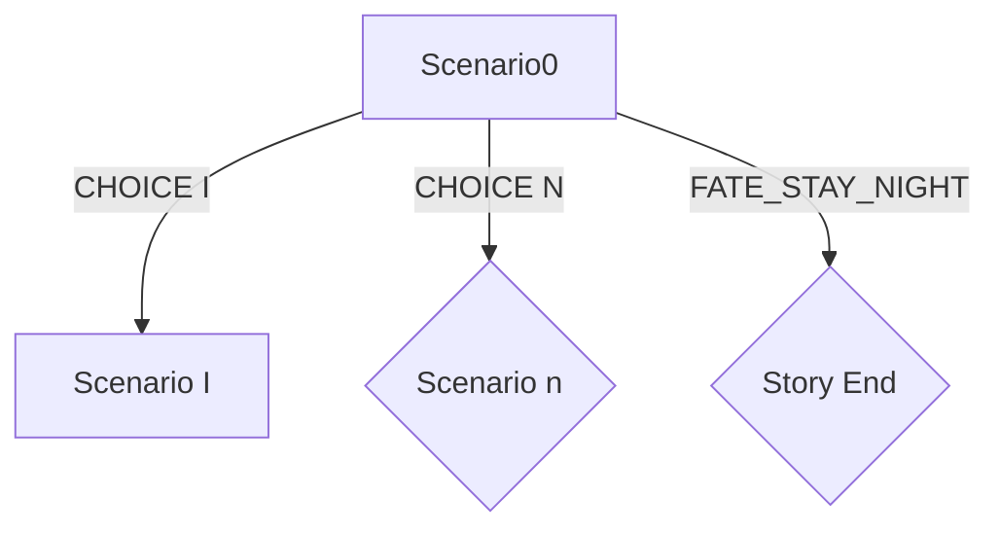

# JiangHu @ Hyperion

## GPS @ JiangHu

The Generative Pre-Trained Script is an algorithm for:

1.  Parse novels with a theme(e.g. Chinese Wuxia, fairy tales) into scripts like this:
    -   Commands: (ADJ)nsubj(ADB)action(ADJ)obj
    -   Scenario: list of cmds
    -   State Machine: definition below:

2.  We used [Pre-Defined Wuxia Plot Model](#Wuxia-Plot) and [Emotional Arcs](https://nofilmschool.com/2016/11/emotional-arcs-6-storytelling-kurt-vonnegut) to make a matrix to plot 
each senario like:

| ⬇️Wuxia Plots➡️Emotional Arcs | "Rags to riches" (rise) | "Tragedy", or "Riches to rags" (fall) | "Man in a hole" (fall-rise) | "Icarus" (rise-fall) | "Cinderella" (rise-fall-rise) | "Oedipus" (fall-rise-fall)
|---|---|---|----|---|---|---
| 比武 | 
| 夺宝 |
| 奇遇 |
| 复仇 |
| 远行 |
| 慕艾 |
| 其他 |

## Quad hero traits

如图：

1.  心：代表人物的性格特质，包括但不限于武侠中的「侠」、16Personalities/Big Five模型中的E/I等
    -   E/I 
2.  智：代表人物的智识特点与学习能力，包括但不限于16Personalities模型中的N/S，武侠中的「悟性」等
    -   N/S
3.  技：代表人物的武术技巧，即武侠中的「武技」部分，包括但不限于棍/剑/掌/镖等技能
    -   剑法
4.  体：代表人物的身体属性，一般很难改变；如DND中的con/dex/str等
    -   STR

### Model Reference

[16 Personalties][1]
[Big Five][2]
[DND Alignment][3]
[Primary Personalty traits][4]
[Lexical Hypothesis][5]

[1]: https://www.16personalities.com/
[2]: http://en.wikipedia.org/wiki/Big_Five_personality_traits
[3]: https://en.wikipedia.org/wiki/Alignment_(Dungeons_%26_Dragons)
[4]: http://ideonomy.mit.edu/essays/traits.html
[5]: https://en.wikipedia.org/wiki/Lexical_hypothesis

## NLP Analysis

>   See scripts/persona.py for details.

### 心

### 智

### 技

### 体

## World Construction