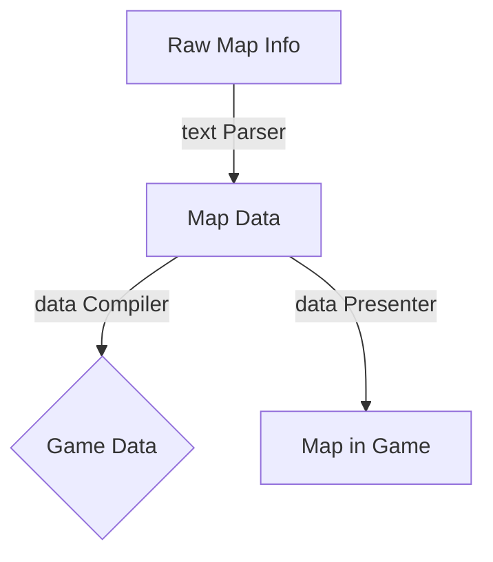
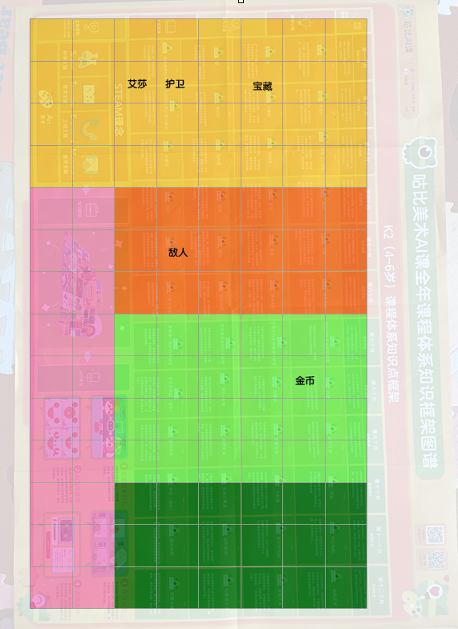

# Map Tools

## Abstract

这个工具将形式化（甚至更进一步的，自然语言化）的地图描述解析成一个M*N的tiles map，每个tile上可以放置一些事先规定好的Obj，包括但不限于：

*   Heroes
*   Friends
*   Treasues
*   NPCs
*   Enemies
*   Events
*   Resources

>   我们相信，这个工具既能满足米饭老师玩小马宝莉冒险游戏的需求；也能在Hyperion里为虚拟DM发挥作用

## Structure



## Map Data Format

json like:

```json
{
"Maps":
[
    {
        "name":"MLB-1",  // Used to identify maps 
        "backgroundImage":"mlp-1.png", // Transparent if none.
        "height":8,
        "width":8,
        "generalTileColor":"RED", // Also could be used in tile materials.
        "SpecialTiles": //  All special tiles.
        [
            {
                "tileType":"Heroes",    // Listed in Abstract
                "tileScript":"MLB-1-2-2.lua",    // Use lua(or some other scripts) to talk/fight/etc
                "tileColor": "GREEN",   //  
                "x":2,
                "y":2
            },
            {

            }
        ]
    },
    {

    }
]
}

```

## Map Example

### Raw data



### Final Script

